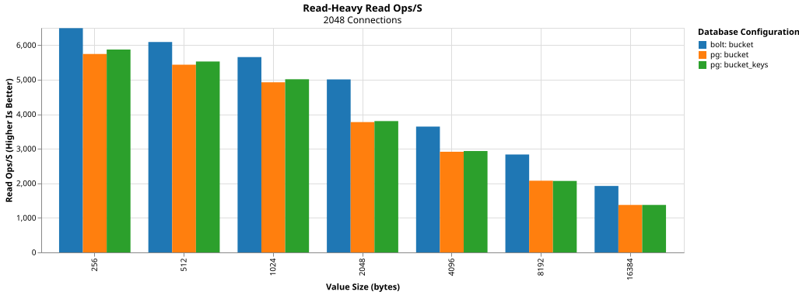
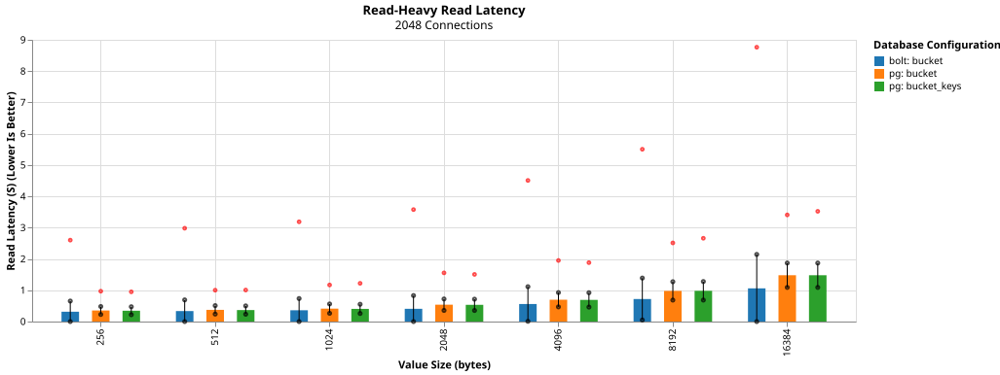
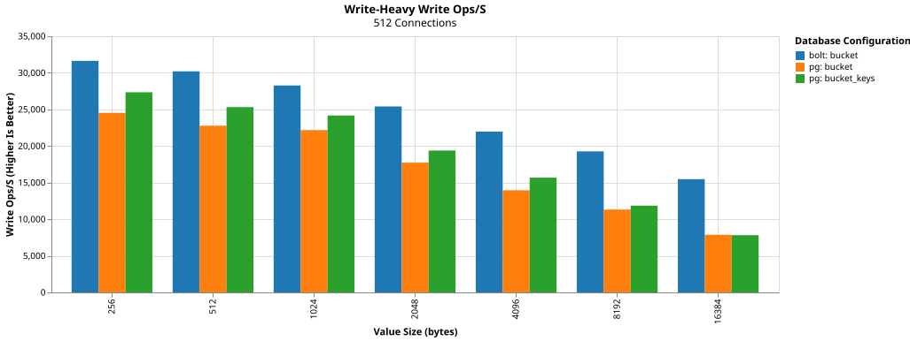
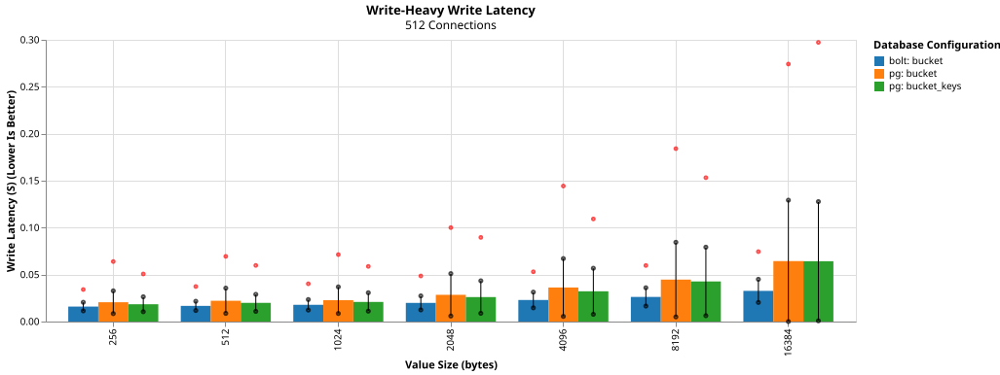
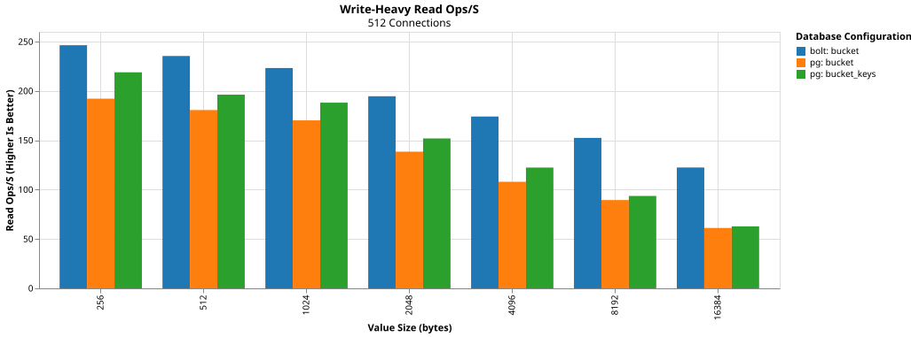
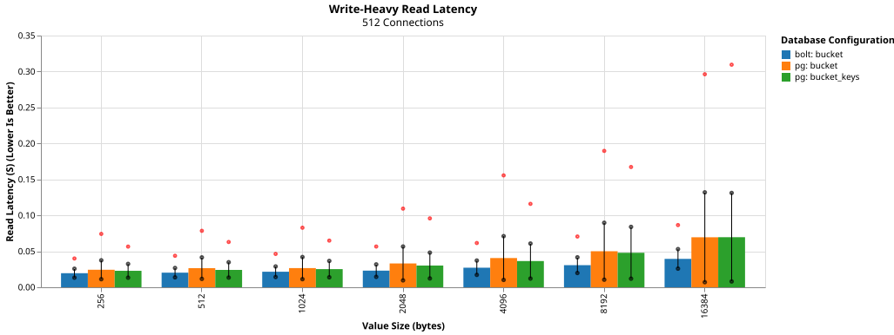
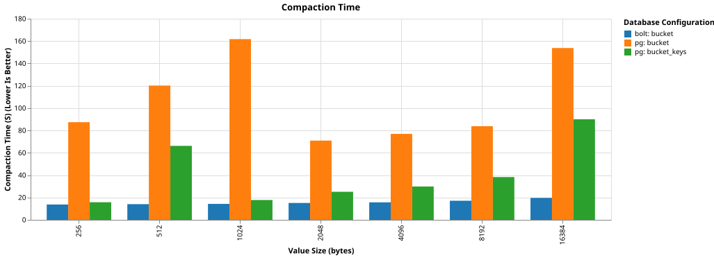
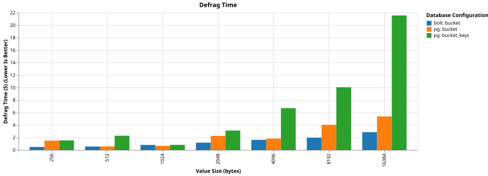

# PostgreSQL ETCD - Part 1

## About This Project
PostgreSQL ETCD is a proof of concept to replace BoltDB, ETCD's database, with PostgreSQL. 
As far as ETCD is concerned nothing has changed.
The Raft algorithm controls the cluster’s resilience.
PostgreSQL is merely an implementation detail for how the data is written and retrieved on disk.

### Prior Art 
* [Kine](https://github.com/k3s-io/kine)
* [SQLite Port of ETCD](https://github.com/etcd-io/etcd/pull/16328)

Note: I did not look at the above projects for inspiration.
I chose to work without pre-conceived bias and solve problems for the fun of it. 

## About Me

I am a Senior Architect with 13 years experience in Red Hat Consulting Services.
I cut my teeth at Red Hat working with JBoss stack including EAP, Process Automation Manager, Decision Manager, Camel, and other frameworks.
Nowadays, I support companies utilizing Red Hat OpenShift, GitOps, Pipelines, and related technologies.

All things being equal, I prefer programming with Rust.

## Disclaimers

AI Disclaimer: These blog entries are my own work.
No AI is used in my writing outside of whatever runs grammer check these days.

I did experiment with Google Gemini at the beginning of this project to explore its capabilities and become familiar with the process.
I used it to generate scaffolds for Docker Compose and refamiliarize myself with PostgreSQL performance best practices.
As I wasn't familiar with Docker Compose, Gemini was a great help with the former.
However, Gemini's distilled wisdom regarding PostgreSQL ended up being wrong in certain areas.

Employment Disclaimer: I work for Red Hat.
This experiment is my own effort on my own time.
It does not reflect product direction for Kubernetes by Red Hat, IBM, or any associated party as far as I'm aware.

## What is ETCD?

[ETCD](https://github.com/etcd-io/etcd) is a distributed, reliable, key-value store for the most critical data of a distributed system.

## What is BoltDB?

[BoltDB](https://github.com/etcd-io/bbolt) is ETCD's file-based datastore.
It is a copy-on-write key-value b-tree index.
BoltDB supports storing byte-array key-value pairs in "bucket" indexes.
Bucket indexes are addressable by a byte-array key.

BoltDB's transaction model works effectively as an upgradeable RWLock. 
Any number of read transactions may be open at a time, while only a single writable transaction may be open.
The writable transaction won't block reads until the transaction commits.

### Limitations
Unfortunately, [BoltDB was poorly designed.](https://news.ycombinator.com/item?id=30015913)

> BoltDB author here. Yes, it is a bad design. The project was never intended to go to production but rather it was a port of LMDB so I could understand the internals. I simplified the freelist handling since it was a toy project. At Shopify, we had some serious issues at the time (~2014) with either LMDB or the Go driver that we couldn't resolve after several months so we swapped out for Bolt. And alas, my poor design stuck around.\
\
LMDB uses a regular bucket for the freelist whereas Bolt simply saved the list as an array. It simplified the logic quite a bit and generally didn't cause a problem for most use cases. It only became an issue when someone wrote a ton of data and then deleted it and never used it again. Roblox reported having 4GB of free pages which translated into a giant array of 4-byte page numbers.


Additionally, BoltDB does not have a concept of a Write Ahead Log (WAL).
The ETCD team built their [own](https://github.com/etcd-io/etcd/blob/v3.6.7/server/storage/wal/wal.go).

### Future
At the time of this writing, BoltDB version 2.0 is in development and may address these shortcomings and improve performance.

## How does ETCD use BoltDB?

Each of ETCD's various components use a dedicated [bucket](https://github.com/etcd-io/etcd/blob/v3.6.7/server/storage/schema/bucket.go#L42).

Though BoltDB supports sub-buckets, ETCD only uses buckets at the database's root. In Go, this would look like:

```go
// BoltDB Bucket Layout 
type BoltBucket {
	btree.Map[string, []byte]
}

// BoltDB Root Index Layout 
type BoltDBRoot {
	btree.Map[string, BoltBucket]
}
```

### Key Bucket

ETCD stores key-value pairs in the `key` bucket.
The following code approximates the data structure used by BoltDB to store the key-value pairs.

```go
// BoltDB Key Bucket Layout, unmarshalled
type BoltKeyBucket {
	btree.Map[BucketKey, KeyValue]
}

// ETCD Data Types
type Revision struct {
	Main int64
	Sub int64
}

type BucketKey struct {
	Revision
	tombstone bool
}

type KeyValue struct {
	Key []byte
	CreateRevision int64
	ModRevision int64
	Version int64
	Value []byte
	Lease int64 
}
```

- `BucketKey` is marshalled to a BigEndian byte array.
- `KeyValue` is marshalled into a byte array using ProtoBuf.

When a client request the value of a key, ETCD first checkes an in-memory tree `treeIndex` to determine the appropriate revision.

```go
type treeIndex struct {
	tree *btree.BTreeG[*keyIndex]
}

type keyIndex struct {
	key         []byte
	modified    Revision
	generations []generation
}

type generation struct {
	ver     int64
	created Revision
	revs    []Revision
}
```

Struct Definition Links:
* [Revision](https://github.com/etcd-io/etcd/blob/v3.6.7/server/storage/mvcc/revision.go#L35)
* [BucketKey](https://github.com/etcd-io/etcd/blob/v3.6.7/server/storage/mvcc/revision.go#L64)
* [KeyValue](https://github.com/etcd-io/etcd/blob/v3.6.7/api/mvccpb/kv.proto#L14)
* [treeIndex](https://github.com/etcd-io/etcd/blob/v3.6.7/server/storage/mvcc/index.go#L39)
* [keyIndex](https://github.com/etcd-io/etcd/blob/v3.6.7/server/storage/mvcc/key_index.go#L73)
* [generation](https://github.com/etcd-io/etcd/blob/v3.6.7/server/storage/mvcc/key_index.go#L346)

## Would PostgreSQL Be More Performant?

Maybe! 

Let's recreate BoltDB's table layout in PostgreSQL to try and get away with minimal code changes!

### Bucket

To replicate `BoltDBRoot`, we create 2 tables:
* buckets - a entry for each bucket
* bucket_data - key-value pairs for every bucket

```sql
CREATE TABLE IF NOT EXISTS buckets(
	bucket_id serial PRIMARY KEY,
	name bytea UNIQUE NOT NULL
);

CREATE TABLE IF NOT EXISTS bucket_data(
	bucket_id integer NOT NULL REFERENCES buckets(bucket_id) ON DELETE CASCADE,
	key bytea NOT NULL,
	value bytea,
	PRIMARY KEY(bucket_id, key)
);
```

### Bucket-Keys

Since the `key` bucket is the most important one when it comes to performance, we'll also create a table to represent the `BoltKeyBucket`.

```sql
CREATE TABLE IF NOT EXISTS key_data(
	key bytea PRIMARY KEY,
	value bytea
)
```

## Performance Comparisons

On an appropriately beefy machine, I compared ETCD using the different options
* bolt: bucket - stock ETCD
* pg: bucket - keys stored in the bucket_data table
* pg: bucket_keys - keys stored separately in the key_data table

Performance tests are run using a modified version of the [`tools/rw-heatmaps/rw-benchmark.sh`](https://github.com/etcd-io/etcd/blob/v3.6.7/tools/rw-heatmaps/rw-benchmark.sh)

* Keys are 256 bytes in size
* The value size depends on the test

### Read-Heavy Benchmark





The benchmark setup uses 2048 simultaneous connections sending 128 read requests per write request.
Each read request retrieves a range of 100 keys.
Each write request puts a single key/value pair into ETCD's database.
Performance is averaged over 5 runs.

For these workloads, BoltDB performs 9-29% more operations per second than the naive PostgreSQL tables.
BoltDB consistently beats the naive PostgreSQL tables in terms of average latency.
The naive PostgreSQL tables have more consistent latency shown by its smaller standard deviation as well as better worst case performance.

### Write-Heavy Benchmark









The benchmark setup uses 512 simultaneous connections sending 128 write requests per read request.
Each read request retrieves a range of 100 keys.
Each write request puts a single key/value pair into ETCD's database.
Performance is averaged over 5 runs.

For these workloads, BoltDB performs 11-50% more read operations per second and 13-49% more write operations per second than the naive PostgreSQL tables.
BoltDB consistently beats the naive PostgreSQL tables in terms of average latency, latency consistency, and worst case performance.

### Compact Command Benchmark



After the Write-Heavy benchmarks were run, the compaction command is sent with `--physical=true`.
Compaction walks the key log and removes all non-current key/value pairs. 
All compacted key/value pairs are hashed together in revision order and the resulting hashed is stored for later comparison.

BoltDB handily beats the naive PostgreSQL tables. 
The `bucket` table configuration struggles with considerable performance degradation.
The `bucket_key` table configuration fairs better, though performance is still behind BoltDB.
You can tell at what value size PostgreSQL's TOAST compression gets enabled.
`bucket_key`'s performance dramatically improves.

### Defrag Command Benchmark



After the compaction command completes, the defrag command is sent.
In BoltDB, this locks and rebuilds the the database by inserting every key into the new file.
This improves performance and reclaims space.
To compare the databases performance as closely as possible, PostgreSQL executes [`VACUUM (FULL, ANALYZE)`](https://www.postgresql.org/docs/18/sql-vacuum.html).
This runs PostgreSQL's maintenance processes, which locks the database tables and reclaims disk space if possible.

BoltDB regularly outperforms the naive PostgreSQL tables during defrag.
I'm surprised at the amount of performance degredation in the `bucket_key` configuration, especially as the value sizes increase.
I'm not sure why the `bucket` table configuration handles VACUUMing that much better.

## ETCD Modifications

Due to ETCD's [Backend](https://github.com/etcd-io/etcd/blob/v3.6.7/server/storage/backend/backend.go#L49) interface, intregrating PostgreSQL was relatively straightforward.
I created a simple harness to connect to, set up, and run queries with PostgreSQL.
The harness is pretty minimal and focuses on wrapping different table configurations for running experiments.

### Dependencies
* [jackc/pgx/v5](github.com/jackc/pgx/v5) for PostgreSQL connectivity
* [bstephenafamo/bob](github.com/stephenafamo/bob) to add some compile-time query correctness guarantees

### PostgreSQL Functions

If at all possible, I would prefer not spending time  tracking down errors due to malformed queries. 
During startup, every PostgreSQL query is turned into a PostgreSQL function.
This improves certain performance aspects and, much more importantly, adds an additional layer of up-front query correctness checking.
Frustratingly, [`ON CONFLICT`](https://www.postgresql.org/docs/18/sql-insert.html) clauses are only checked during query runtime. 

## ETCD Performance

### AOS vs. SOA

Early in this effort, Gemini suggested I should send transactions as an Array of Structs (AOS) using PostgreSQL's [`COPY`](https://www.postgresql.org/docs/18/sql-copy.html) protocol to improve performance.
Since my querries needed `ON CONFLICT` clauses, that would not work. 
Gemini recommended `COPY`ing the transactions to a temporary table first, then upserting everything at once.

I found that sending the data as a Struct of Arrays (SOA) and upserting the data with the [`unnest`](https://www.postgresql.org/docs/current/functions-array.html) function is substantially faster.

### Unsafe []byte to string conversion

At several locations I needed to keep track of which keys would be returned during a query.
Due to how Go treats arrays/slices, `[]byte` keys needed to be cast to `string`s before I could use them in a map.
While individually cheap, these casts added up during performance benchmarks.
Since the keys never changed, I used `unsafe.String` to improve performance.

### Key-Aware Queries

ETCD directly walks BoltDB's b-tree using a cursor when iterating keys and related operation.
This keeps any loop between application and database tight and performant.

Translating this directly into PostgreSQL's qeuries meant that each and every key would have its own search query.
This causes major performance problems.
To improve performance, these queries and the surrounding application code were rewritten to collect all the keys in an array first and send them as a batch.
Despite using batches performance is still lacking.

### Wal Compression

Several tests focused on determing if PostgreSQL's Write Ahead Log (WAL) Compression.
They compared no, pglz, and lz4 compression.
While I found a a drammatic decrease in block IO using compression, there was no corresponding performance difference using SSD drives.

## Next Steps

Naively replicating BoltDB's table layout in PostgreSQL didn't provide any meaningful performance improvements.

In the next entry in this series, we'll see what else we might do to improve ETCD performance.